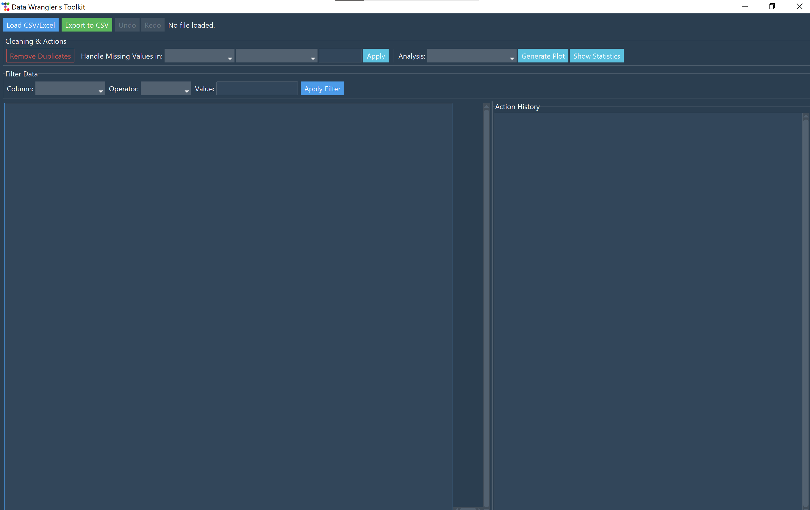
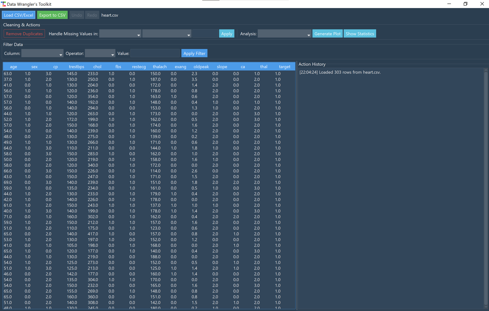
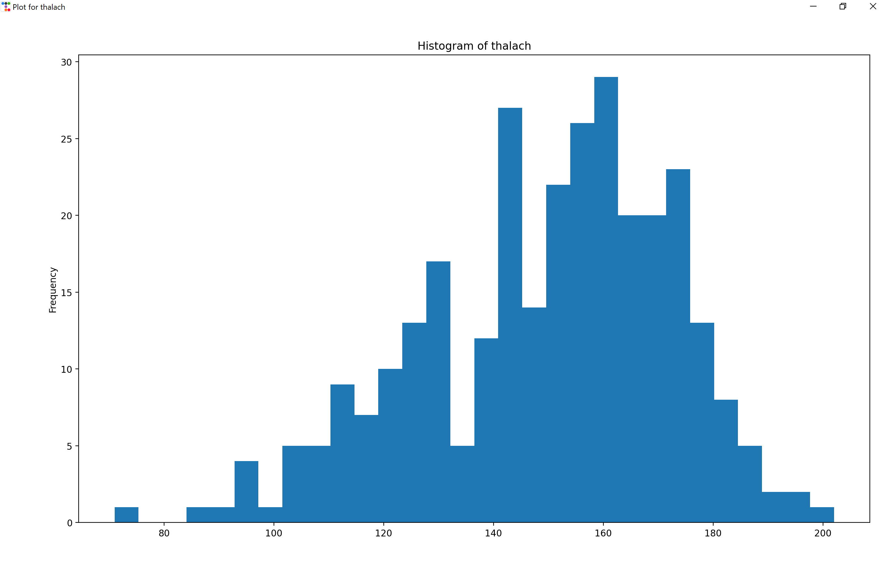
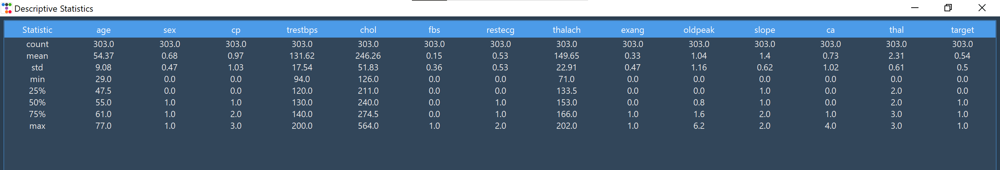

# Data Wrangler's Toolkit 🛠️

A feature-rich desktop application built with Python for cleaning, filtering, visualizing, and saving data from CSV and Excel files. This tool provides a user-friendly graphical interface to perform common data wrangling tasks without writing any code.

---

## ✨ Key Features

* **Modern UI:** A professional and responsive UI built with `ttkbootstrap`, featuring both dark and light themes.
* **File Handling:** Load data from `.csv`, `.xlsx`, and `.xls` files, and export the cleaned data back to a new `.csv` file.
* **Data Cleaning:**
    * **Remove Duplicates:** Instantly find and remove duplicate rows.
    * **Handle Missing Values:** An interactive panel to drop rows with missing data or fill them using calculated (mean, median, mode) or custom values.
* **Interactive Filtering:** A powerful panel to filter data based on column values using a variety of operators (`==`, `>`, `<`, `contains`, `is null`, etc.).
* **Data Visualization:** Generate plots directly from the data.
    * **Histograms** for visualizing the distribution of numeric data.
    * **Bar Charts** for visualizing the frequency of categorical data.
* **Descriptive Statistics:** Instantly generate a summary table with key statistical information (mean, std, count, unique values, etc.) for all columns.
* **State Management:** A robust **Undo/Redo** system allows for easy correction of mistakes.
* **Action History:** A timestamped log that tracks every cleaning and filtering action performed by the user.
* **Unit Tested:** Core data logic is validated with an automated test suite using `pytest`.

---

## 📸 Screenshots

Here is the application in action using the "superhero" dark theme.

**Main Application Window**





**Plot Generation**



**Statistics Summary**



---

## 🚀 Getting Started

Follow these instructions to get a copy of the project up and running on your local machine.

### Prerequisites

* Python 3.8+

### Installation & Setup

1.  **Clone the repository:**
    ```bash
    git clone [https://github.com/](https://github.com/)[YOUR_USERNAME]/data-wrangler-toolkit.git
    ```
2.  **Navigate to the project directory:**
    ```bash
    cd data-wrangler-toolkit
    ```
3.  **Create and activate a virtual environment:**
    * On Windows:
        ```bash
        python -m venv venv
        venv\Scripts\activate
        ```
    * On macOS/Linux:
        ```bash
        python3 -m venv venv
        source venv/bin/activate
        ```
4.  **Install the required packages:**
    ```bash
    pip install -r requirements.txt
    ```

---

## Usage

To start the application, run the following command from the root directory:
```bash
python main.py